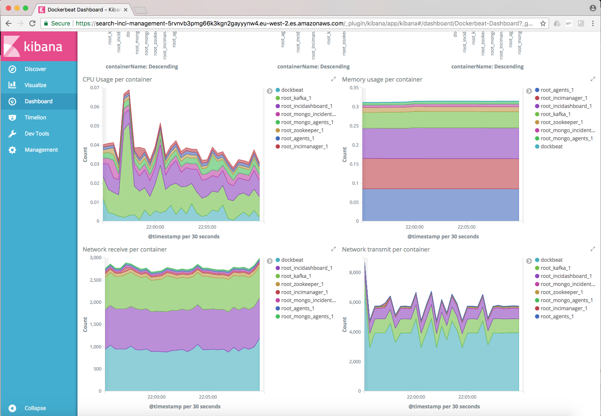

# Inci_i2b
Incidence system i2b

# Graphic Representation

# Deployment
The Incidence System is deployed using Digital Ocean. You can access every module using the following links:
* Agents: http://178.62.52.250:8080
* Manager: http://178.62.52.250:8081
* Dashboard: http://178.62.52.250:8082

We also have an ElasticSearch cluster in the cloud (Amazon Web Services) receiving logs with metrics from the Incidence System. These logs can be visualized from Kibana to monitor the state of the deployed application. You can access Kibana through the following link: https://search-inci-management-5rvnvb3pmg66k3kgn2gayyynw4.eu-west-2.es.amazonaws.com/_plugin/kibana/app/kibana#/discover?_g=()

